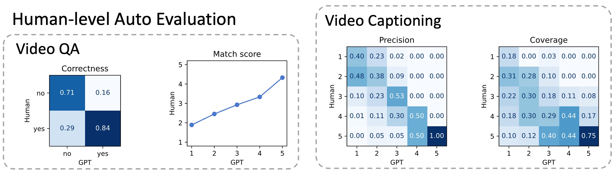

# VLM-Eval: A General Evaluation on Video Large Language Models 🎯🔍

[](https://arxiv.org/abs/2311.11865)
[](https://github.com/zyayoung/Awesome-Video-LLMs/blob/main/LICENSE)

[](https://github.com/zyayoung/Awesome-Video-LLMs/stargazers)
[](https://github.com/zyayoung/Awesome-Video-LLMs/issues?q=is%3Aopen+is%3Aissue)
[](https://github.com/zyayoung/Awesome-Video-LLMs/issues?q=is%3Aissue+is%3Aclosed)
[](https://github.com/sindresorhus/awesome)

</img> Official repository of [VLM-Eval: A General Evaluation on Video Large Language Models](https://arxiv.org/abs/2311.11865).

This project thoroughly assesses Video Large Language Models.



- **GPT-based Evaluation**: Leveraging the power of GPT, we demonstrate reliable and efficient evaluation of open-ended response quality for *[video captioning](#caption-gpt)* and *[video question answering](#qa-gpt)* tasks.

- **Retrieval-based Evaluation**: Retrieval-based evaluation focuses on assessing abilities in downstream applications through *[video-text retrieval](#caption-text-video-retrieval)* and *[action recognition](#action-regonition)*.

## Awesome Video Large Language Models 🎥🦙

We welcome additions to the list of papers and models, as well as evaluation results.

- Video-LLaMA: An Instruction-tuned Audio-Visual Language Model for Video Understanding  [Paper](https://arxiv.org/pdf/2306.02858.pdf) [Github](https://github.com/DAMO-NLP-SG/Video-LLaMA) [Demo](https://huggingface.co/spaces/DAMO-NLP-SG/Video-LLaMA)
- VideoChat: Chat-Centric Video Understanding [Paper](https://arxiv.org/pdf/2305.06355.pdf) [Github](https://github.com/OpenGVLab/Ask-Anything)
- Video-ChatGPT: Towards Detailed Video Understanding via Large Vision and Language Models [Paper](https://arxiv.org/abs/2306.05424) [Github](https://github.com/mbzuai-oryx/Video-ChatGPT)
- Video-LLaVA: Learning United Visual Representation by Alignment Before Projection [Paper](https://arxiv.org/pdf/2311.10122.pdf) [Github](https://github.com/PKU-YuanGroup/Video-LLaVA) [Demo](https://huggingface.co/spaces/LanguageBind/Video-LLaVA)
- VideoChat2: Chat-Centric Video Understanding [Paper](https://arxiv.org/abs/2311.17005) [Github](https://github.com/OpenGVLab/Ask-Anything/tree/main/video_chat2) [Demo](https://huggingface.co/spaces/OpenGVLab/VideoChat2)
- LLaMA-VID: An Image is Worth 2 Tokens in Large Language Models  [Paper](https://arxiv.org/pdf/2311.17043.pdf) [Github](https://github.com/dvlab-research/LLaMA-VID) [Demo](http://103.170.5.190:7864/)

## Datasets 💾🌐

The following datasets are used in our training.

| Dataset                                                                                                                                        | Task Domain                             | Scale |
| :--------------------------------------------------------------------------------------------------------------------------------------------- | :-------------------------------------- | :---: |
| WebVid [link](https://github.com/m-bain/webvid)                                                                                                | Video captioning                        |  10M  |
| NExT-QA [link](https://doc-doc.github.io/docs/nextqa.html)                                                                                     | Video QA                                |  5K   |
| DiDemo [link](https://github.com/LisaAnne/TemporalLanguageRelease)                                                                             | Video captioning, temporal localization |  10K  |
| MSRVTT [link](https://www.microsoft.com/en-us/research/publication/msr-vtt-a-large-video-description-dataset-for-bridging-video-and-language/) | Video QA, video captioning              |  10K  |
| MSVD [link](https://www.cs.utexas.edu/users/ml/clamp/videoDescription/)                                                                        | Video QA, video captioning              |  2K   |
| TGIF-QA [link](https://github.com/YunseokJANG/tgif-qa/blob/master/dataset/README.md)                                                           | Video QA                                |  72K  |
| HMDB51 [link](https://serre-lab.clps.brown.edu/resource/hmdb-a-large-human-motion-database/)                                                   | Action recognition                      |  7K   |
| UCF101 [link](https://www.crcv.ucf.edu/data/UCF101.php)                                                                                        | Action recognition                      |  13K  |
| VideoInstruct-100K [link](https://huggingface.co/datasets/MBZUAI/VideoInstruct-100K)                                                           | Chat                                    | 100K  |

Other datasets:

| Dataset                                                                                                       | Task Domain        | Scale |
| :------------------------------------------------------------------------------------------------------------ | :----------------- | :---: |
| VideoChatInstruct-11K [link](https://github.com/OpenGVLab/InternVideo/tree/main/Data/instruction_data)        | Chat               |  11K  |
| Valley-webvid2M-Pretrain-703K [link](https://huggingface.co/datasets/luoruipu1/Valley-webvid2M-Pretrain-703K) | Video captioning   | 703K  |
| Valley-Instruct-73k [link](https://huggingface.co/datasets/luoruipu1/Valley-Instruct-73k)                     | Chat               |  73K  |
| Kinetics-400 [link](https://github.com/cvdfoundation/kinetics-dataset)                                        | Action recognition | 650K  |

## Results

| Method                                                                         | QA<br>Acc | QA<br>Match | Cap<br>Prec | Cap<br>Cov | T2V<br>Acc5 | V2T<br>Acc5 | Act<br>Acc1 | Act<br>Acc5 |
| ------------------------------------------------------------------------------ | :-------: | :---------: | :---------: | :--------: | :---------: | :---------: | :---------: | :---------: |
| [Video-LLaMA](https://github.com/DAMO-NLP-SG/Video-LLaMA)                      |   32.2    |    2.26     |    1.99     |    2.08    |    23.4     |    23.4     |    28.2     |    47.6     |
| [VideoChat](https://github.com/OpenGVLab/Ask-Anything)                         |   41.6    |    2.63     |    2.02     |    2.16    |    25.8     |    30.3     |    36.0     |    56.8     |
| [Video-ChatGPT](https://github.com/mbzuai-oryx/Video-ChatGPT)                  |   46.2    |    2.84     |    2.49     |    2.65    |    28.2     |  **32.8**   |    40.3     |    64.5     |
| Video-LLaVA (VLM-Eval)                                                         |   48.8    |  **2.98**   |  **2.75**   |  **2.86**  |  **33.5**   |    31.9     |    43.0     |    64.3     |
| [Video-LLaVA (Lin et al.)](https://github.com/PKU-YuanGroup/Video-LLaVA)       |   48.0    |    2.90     |    2.18     |    2.29    |    29.7     |    31.4     |    41.3     |    63.9     |
| [VideoChat2](https://github.com/OpenGVLab/Ask-Anything)                        |   44.6    |    2.80     |    2.29     |    2.42    |    28.9     |    28.7     |    35.6     |    55.4     |
| [LLaMA-VID](https://huggingface.co/YanweiLi/llama-vid-7b-full-224-video-fps-1) | **50.1**  |    2.97     |    2.18     |    2.25    |    29.4     |    30.1     |  **45.1**   |  **67.4**   |

## Getting Started 🚀👨‍💻

Begin your journey with VLM-Eval using these evaluation examples. At the current stage, it is necessary for you to download videos from the original datasets. We also highly recommend that you ask us to test your open-sourced video LLM.

### Set OpanAI API Key

The initial step involves setting your OpenAI key in the environment. You can do this by utilizing the command provided below.

```bash
export OPENAI_API_KEY="your api key here"
```

### Caption GPT

The following command provided will guide GPT-3.5 to assess video captions within the MSVD dataset.
The overall usage comprises approximately 62K prompt tokens and 14K completion tokens. This process will only incur a cost of about $0.09.

It is normal to encounter some errors during the GPT evaluation process. The evaluation code is designed to retry automatically.

You may download the prediction file `msvd_cap_results_final.json` from [here](https://drive.google.com/file/d/1v016zOWFiYWoXrJfGfF3iL5_v6BBQ4ST/view?usp=sharing), and the gt file MMGPT_evalformat_MSVD_Caption_test.json from [here](https://drive.google.com/file/d/1pRMhK2FV5Db4zHKX0vAbSVL21pbHBv1T/view?usp=sharing).

```bash
python -m eval_bench.gpt_eval.evaluate_cap_pr_v2 \
    --pred_path path/to/msvd_cap_results_final.json \
    --gt /data/data/labels/test/MMGPT_evalformat_MSVD_Caption_test.json \
    --output_dir results/ours/msvd_cap_pr/ \
    --output_json results/ours/acc_msvd_cap_pr.json \
    --out_path results/ours/cap_pr_metric_msvd.json \
    --num_tasks 8 \
    --kernel_size 5 \
    --max_try_times 15
```

### Caption Text-Video Retrieval

```bash
python -m eval_bench.eval_cap_ret \
    --eval_task retrieval \
    --pred path/to/msvd_cap_results_final.json \
    --gt /data/data/labels/test/MMGPT_evalformat_MSVD_Caption_test.json \
    --clip_model ViT-B/32
```

### Caption CIDEr

```bash
python -m eval_bench.eval_cap_ret \
    --eval_task caption \
    --pred path/to/msvd_cap_results_final.json \
    --gt /data/data/labels/test/MMGPT_evalformat_MSVD_Caption_test.json
```

### QA GPT

You may download the prediction file `msvd_qa_preds_final.json` from [here](https://drive.google.com/file/d/1_Gsg3WvxtADouqwYLXGf9Q2rjw23N1cC/view?usp=sharing). There is no need for a separate ground truth file since the ground truth is already embedded within the prediction file.

```bash
python -m eval_bench.gpt_eval.evaluate_qa_msvd \
    --pred_path path/to/msvd_qa_preds_final.json \
    --output_dir results/ours/msvd_qa/ \
    --output_json results/ours/acc_msvd_qa.json \
    --out_path results/ours/qa_metric_msvd.json \
    --num_tasks 8 \
    --task_name MSVD \
    --kernel_size 10 \
    --max_try_times 15
```

### Action Recognition

```bash
python -m eval_bench.eval_cap_ret \
    --eval_task action \
    --pred_path mmgpt/0915_act/ucf101_action_preds_final.json \
    --out_path results/mmgpt/0915_act/ucf101_action_preds_final.json \
    --clip_model ViT-B/32
```

Enjoy exploring and implementing VLM-Eval! 💡👩‍💻🌍

## License 📝🔐

This project is licensed under the terms of the [MIT License](LICENSE).

## Credit 🎓🤝

Contributions from the following sources have shaped this project:

- [Awesome-Multimodal-Large-Language-Models](https://github.com/BradyFU/Awesome-Multimodal-Large-Language-Models)
- [coco-caption](https://github.com/tylin/coco-caption)
- [LLaVA](https://github.com/haotian-liu/LLaVA)
- [Ask-Anything](https://github.com/OpenGVLab/Ask-Anything)
- [Video-ChatGPT](https://github.com/mbzuai-oryx/Video-ChatGPT)

## Citing VLM-Eval 📚🖋

If the VLM-Eval framework proves valuable to your research, please consider acknowledging it with the provided citation, and don't forget to give it a star!

```bibtex
@article{li2023vlm,
  title={VLM-Eval: A General Evaluation on Video Large Language Models},
  author={Li, Shuailin and Zhang, Yuang and Zhao, Yucheng and Wang, Qiuyue and Jia, Fan and Liu, Yingfei and Wang, Tiancai},
  journal={arXiv preprint arXiv:2311.11865},
  year={2023}
}
```
